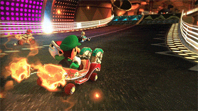
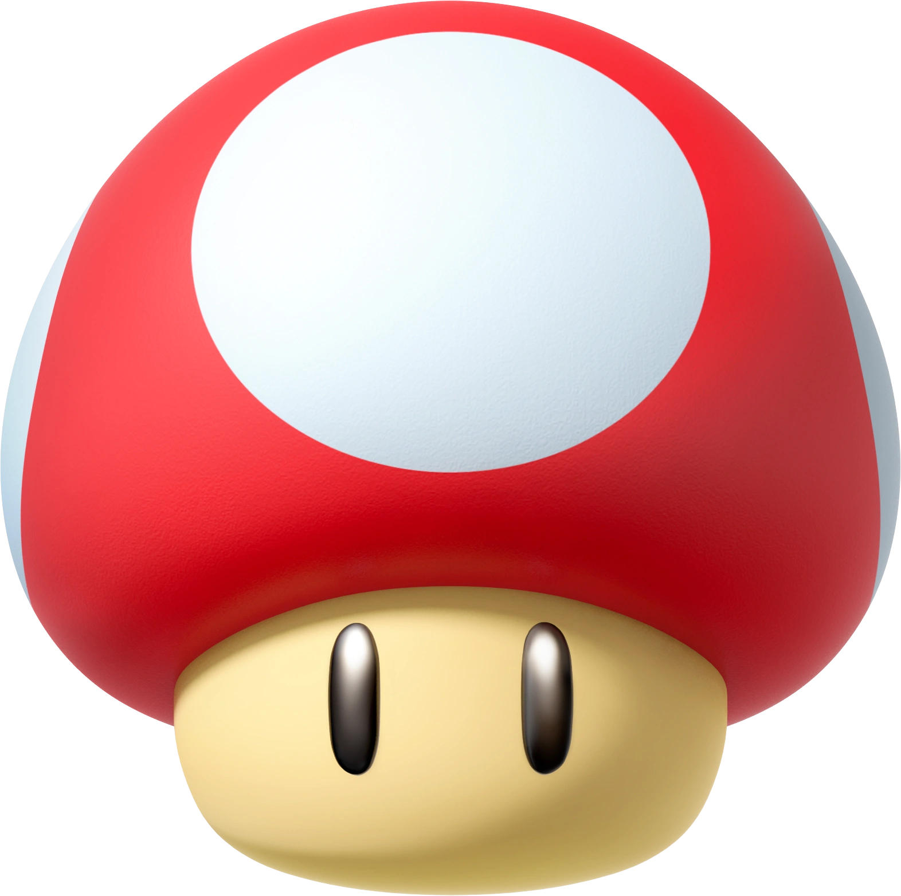
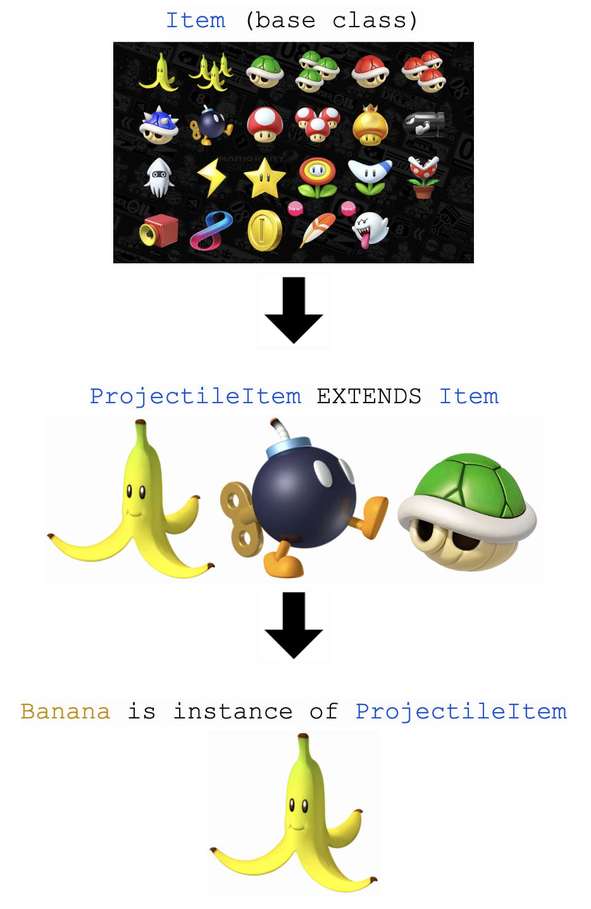
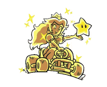

# Object-Oriented Programming with Mario Kart

**Audience**: High school students or adults with some exposure to coding. 

<small>*Not optimized for mobile devices (yet). Some interactive widgets may not work properly on a phone or tablet.*</small>

<br>

---

<br>

## Intro to Object-Oriented Programming

In programming, there are many different ways to think about and solve a problem. Some approaches focus on steps and instructions (like a recipe), while others focus on the *things* involved in the problem and what they can do (like the ingredients and tools in a kitchen).

**Object-oriented programming (OOP)** is a way of writing programs by modeling parts of a problem as individual **objects.**

An object represents something meaningful in the problem you're solving. Objects have **attributes**, which describe what they are, and **behaviors**, which describe what they can do.

For example, we could model a candle as an object. A candle can be lit or unlit, and there are specific actions we can take that change that **state**: you can light an unlit candle, or blow out a lit one.

A candle also has characteristics we might want to store, like its color and its height. The height changes over time, but only while the candle is lit—so knowing whether the candle is lit or unlit matters to how the candle behaves.

In object-oriented programming, we can represent all of this by grouping the candle's data (its color, height, and whether it's lit) together with the actions that affect it (lighting and blowing it out) into a single object.

Below, you can choose the color of the candle and press buttons to light it or blow it out. The height decreases while the candle is lit, but you can make it taller again by dragging the slider up when the candle is unlit.

<div id="candle"></div>
<script type="module" src="../assets/Candle.js"></script>
<br>

---

<br>

## Modeling Items in Mario Kart

Now let's look at a more exciting example—Mario Kart! Mario Kart is a series of racing games published by Nintendo. Don't worry if you're not familiar with the games. We'll cover anything specific to Mario Kart that you need to know.

Mario Kart has a lot of different objects we could model, for example, the **items**. Some items you aim at other cars hoping you land a hit and can pass them while they spin out.

<div style="text-align: center; margin: 1.5rem 0;">
  
</div>

<small><i>Luigi hits Rosalina with a red turtle shell and can pass her while she recovers control of her kart.</i></small>

<div style="text-align: center;"><small><a href="https://media4.giphy.com/media/v1.Y2lkPTc5MGI3NjExMjlnMmxkamhmZ3Y4cDh2OW9xOTNtNG9uYjZpZGZ2cG9xdjliZ201ZiZlcD12MV9pbnRlcm5hbF9naWZfYnlfaWQmY3Q9Zw/NXDoaAmF7dkyc/giphy.gif">GIF Credit - Giphy</a></small></div>

<br>

Some items, like Mushrooms, give your kart a temporary speed boost. A Star gives you invincibility from attacks like the one in the clip above.

<div style="display: flex; justify-content: center; gap: 1rem; margin: 1.5rem 0; flex-wrap: wrap;">
  
  
  
</div>

<div style="text-align: center;"><small><a href="https://mariokart.fandom.com/wiki/Item">Images from MarioKart.Fandom.com</a></small></div>

<br>

Different categories of items behave differently, but they also have some things in common.

Let's sort out things that *all* Mario Kart items have in common compared to what might be specific attributes of certain kinds of items.

<div id="attribute-sorting"></div>
<script type="module" src="../assets/AttributeSorting.js"></script>
<br>

What we demonstrated here is that all items have a name and can be used, but not all items work the same or have the same effects. 

**Even though items have different effects, the game can interact with all of them in the same way.** When you're playing the game, you press the same button to use an item regardless of which one you have. At the level of a button press, the game doesn't need to know which specific item you're holding, and this vastly simplifies things for the program.

Using object-oriented programming, we can let each specific item define how it behaves when used, while the rest of the game only needs to know how to work with a generic `Item`. This lets the program treat all items the same: pick up an `Item`, then use it.

Let's model a generic `Item` in **pseudocode**—a simplified way of describing code without using any specific language—and in the programming language **Python**. In Python, a blueprint for an object is called a `class`, which defines the attributes and methods that objects of the class all have.

<small>Note: New to seeing things formatted like <code>Item</code> or <code>class</code>? This special format just shows that we're talking about code.</small>

<br>
<div id="multiple-choice-quiz-class-name"
    data-question='The name "class" was chosen intentionally. In object-oriented programming, what might we mean when we say a "class"?'
    data-options='["School Course", "Category", "Stylish / Classy"]'
    data-correct-answer="1"
    data-explanations='["Hint: Another synonym for class, as we mean it here, is \"type\".", "", "Hint: Another synonym for class, as we mean it here, is \"type\"."]'>
</div>
<script type="module" src="../assets/MultipleChoiceQuiz.js"></script>
<br>

A **class** represents a category of objects that share the same attributes and behaviors (in this case, all `Items` in Mario Kart have in common that they have names and can be used by pressing a button). Here, we're defining what's called a **base class**: a blueprint for other, more specific class types to follow (Hint: 🍌, 🍄, ⭐). We'll see concretely how that works later.

For now, here's what an `Item` class might look like in pseudocode and in Python. Don't worry about the exact syntax yet (things like `__init__` or `self`). For now, focus on how we're capturing **attributes**—what the object *is*—and **methods**—functions that show what the object *can do*.

<br>
<div id="code-comparison-item"
    data-pseudocode='
CLASS Item
    ATTRIBUTE name

    METHOD use()
        # Apply the item&apos;s effect
        # We&apos;ll let specific items implement their own method use()'
    data-python='
class Item:
    def __init__(self, name):
        self.name = name

    def use(self):
        """Apply the item&apos;s effect"""
        pass'>
</div>
<script type="module" src="../assets/CodeComparison.js"></script>
<br>

Notice we don't specify any instructions for what a generic item does when we `use()` it. Different item categories in Mario Kart work differently, so we'll create more specific types of items, following this base class's blueprint, and define what it means to use each of these specific items.

## Modeling a Projectile Item

### Creating our blueprint

One of the most iconic items in Mario Kart is the banana—roll over a banana and it'll cause your kart to slip and spin out! When you use a banana, a turtle shell, or any other projectile item, you can choose whether to throw it in front of or behind your kart. So when we `use()` this type of item, we need to know what direction it's being thrown in. `direction` will be a **parameter** that we pass to our method like: `use(direction)`. `direction` will either be "forward" or "backward". Pay attention to how we use the parameter in the method.

<br>
<div id="code-comparison-item"
    data-pseudocode='
CLASS ProjectileItem EXTENDS Item

    METHOD use(direction)
        IF direction is "forward"
            PRINT "self.name is thrown in front of the kart."
        IF direction is "backward"
            PRINT "self.name is thrown behind the kart."
        ELSE
            ERROR'
    data-python='
class ProjectileItem(Item):
    """Items you throw forward or backward."""

    def use(self, direction):
        if direction == "forward":
            print(f"{self.name} is thrown in front of the kart.")
        elif direction == "backward":
            print(f"{self.name} is thrown behind the kart.")
        else:
            raise ValueError("direction must be &apos;forward&apos; or &apos;backward&apos;")'>
</div>
<script type="module" src="../assets/CodeComparison.js"></script>
<br>

<br>
<div id="multiple-choice-quiz-direction"
    data-question='In the Python code above, how do we use our parameter &lt;code&gt;direction&lt;/code&gt;?'
    data-options='["We check its value", "We change its value"]'
    data-correct-answer="0"
    data-explanations='["We use <code>if</code> to check whether <code>direction</code> is &apos;forward&apos; or &apos;backward&apos;.", "Actually we don&apos;t change its value—look at how we use <code>IF</code>. We use those to check <i>if</i> <code>direction</code> is &apos;forward&apos; or &apos;backward&apos;."]'>
</div>
<script type="module" src="../assets/MultipleChoiceQuiz.js"></script>
<br>

We check the value of `direction` and if it equals "forward", then we throw the item in front of the kart. If it equals "backward", we throw the item behind the kart. If it doesn't equal "forward" *or* "backward", we throw an error—we don't know what to do in that case!

### Creating instances

We've finished creating our blueprint for a `ProjectileItem`, so let's test our new item! First, we use our `ProjectileItem` blueprint to create a particular **instance** of that type of item—it could be a banana, a shell, a "bob-omb", or any other item that shares the functionality and attributes of a `ProjectileItem`.

In Python, we create a specific **instance** of a **class** by saving it to a **variable**. A variable is how we save that item so we can reference it later. Here's how we could create a few items; there are always tons of items in a game of Mario Kart!

```python
banana_1 = ProjectileItem("banana")
banana_2 = ProjectileItem("🍌")  # you can give your item any name you want

red_shell = ProjectileItem("red shell")
my_shell = ProjectileItem("shell")  # and you can name your variable whatever you want
```

Now that you know how to create an item, try using different projectile items by setting the `name` and **calling** (running) the `use()` method!

<div id="interactive-code-runner-name"
    data-code-template='my_item = ProjectileItem("<name>")
my_item.use("forward")'
    data-output-template='<name> is thrown in front of the kart.'
    data-choices='["banana", "red_shell", "bob_omb"]'
    data-choice-label='Choose an item:'>
</div>
<script type="module" src="../assets/InteractiveCodeRunner.js"></script>
<br>

And test out throwing an item in a specific `direction`:

<br>
<div id="interactive-code-runner-direction"
    data-code-template='banana_item = ProjectileItem("🍌")
banana_item.use(<direction>)'
    data-output-template='🍌 is thrown <in front of/behind> the kart.'
    data-choices='["forward", "backward"]'
    data-choice-label='Choose a direction:'>
</div>
<script type="module" src="../assets/InteractiveCodeRunner.js"></script>
<br>

### Inheritance

You might be wondering, how are we able to set a `name` for `ProjectileItem` when we didn't specify it had an attribute `name`?

<br>
```python
CLASS ProjectileItem EXTENDS Item
    # no name attribute??

    METHOD use(direction)
        IF direction is "forward"
            PRINT "self.name is thrown in front of the kart."
        IF direction is "backward"
            PRINT "self.name is thrown behind the kart."
        ELSE
            ERROR
```
<br>

Can you take a guess?

<br>
<div id="multiple-choice-quiz-name"
    data-question='How can a <code>ProjectileItem</code> object have a name even though <code>ProjectileItem</code> doesn’t define name?'
    data-options='["This actually doesn&apos;t work-we need to fix <code>ProjectileObject</code> to have an attribute for <code>name</code>", "<code>ProjectileItem</code> is a type of <code>Item</code>, and all <code>Item</code>s have names.", "<code>ProjectileItem</code> gets its own name automatically because we passed one in when we created it."]'
    data-correct-answer="1"
    data-explanations='["Actually, <code>ProjectileItem</code> is a type of <code>Item</code>, and all <code>Item</code>s have names. Read on, I&apos;ll explain further!", "", "Passing in &apos;banana&apos; doesn&apos;t automatically create a <code>name</code> attribute. The <code>name</code> attribute comes from <code>Item</code>. Because <code>ProjectileItem</code> is a type of <code>Item</code> and all <code>Item</code>s have <code>name</code>s, <code>ProjectileItem</code>s also have <code>name</code>s. Read on and let&apos;s dig into this a bit more."]'>
</div>
<script type="module" src="../assets/MultipleChoiceQuiz.js"></script>
<br>

`ProjectileItem` is a type of `Item`, and because `Item` has a `name` attribute, then so does `ProjectileItem`. In the pseudocode, we say that `ProjectileItem EXTENDS Item`. In Python, we do this by putting the **parent class** in parentheses: `ProjectileItem(Item)`.

When a class **extends** another class, it automatically has access to all of the *parent* class's attributes and methods. This is called **inheritance** (`ProjectileItem` *inherits from* `Item`) and is how we define sub-categories of objects. A banana (for example, `ProjectileItem("Banana")`) is an instance of `ProjectileItem`, which is a more specific type of `Item`.

Because of this, anywhere the program expects an `Item`, it can work with a `ProjectileItem` too. The rest of the system doesn't need to know exactly which kind of item it's holding—it just knows it has an `Item`, and that it can call `use()` on it and access its `name`.

<div style="text-align: center; margin: 1.5rem 0;">
  
</div>

<div style="text-align: center;"><small><a href="https://mariokart.fandom.com/wiki/Item">Images from MarioKart.Fandom.com</a></small></div>

<br>

---

<br>

## Modeling Karts

We've modeled the basics of what items are and what they can do and how projectile items, specifically, work. Next, let's look at how items interact with another part of the game—karts. In the full game, karts can accelerate, brake, and steer—but for now, we'll focus only on how a kart is affected by items.

<br>
<div id="multiple-choice-quiz-banana"
    data-question='In Mario Kart, what happens when you run over a banana?'
    data-options='["You gain a banana item", "Your car spins out"]'
    data-correct-answer="1"
    data-explanations='["Actually, if you run over a banana, your car spins out and you can&apos;t make forward progress for a moment.", ""]'>
</div>
<script type="module" src="../assets/MultipleChoiceQuiz.js"></script>
<br>

Hitting a banana doesn't give you an item—it changes the **state** of your kart. The kart is now spun out, and that information needs to be remembered somewhere. We've seen this before, with our candle. The candle can be lit or unlit, and we can change its state by lighting it or blowing it out.

Keeping that in mind, let's figure out how we want to include spinning out in our `Kart` model.

<br>
<div id="multiple-choice-quiz-spinout-behavior"
    data-question='How might we think about spinning out as an action?'
    data-options='["As a method like spin_out()", "As an attribute like is_spun_out"]'
    data-correct-answer="0"
    data-explanations='["A kart can spin out, which is an action. Actions are naturally represented by methods like spin_out().", "An attribute allows us to remember what state we&apos;re in, but how do we change that state?"]'>
</div>
<script type="module" src="../assets/MultipleChoiceQuiz.js"></script>
<br>

<div id="multiple-choice-quiz-spinout-state"
    data-question='How might we think about spinning out as a state?'
    data-options='["As a method like spin_out()", "As an attribute like is_spun_out"]'
    data-correct-answer="1"
    data-explanations='["A method allows us to change state, but how do we remember what state we&apos;re in?", "A kart can be spun out or not. That&apos;s information we want to remember, so it makes sense to store it in an attribute like is_spun_out."]'>
</div>
<script type="module" src="../assets/MultipleChoiceQuiz.js"></script>
<br>

<div id="multiple-choice-quiz-spinout-both"
    data-question='So which do we need to model spinning out?'
    data-options='["Only a method", "Only an attribute", "Both a method and an attribute"]'
    data-correct-answer="2"
    data-explanations='["A method captures the action of spinning out, but without an attribute we can&apos;t keep track of whether the car is still spinning out or not.", "An attribute keeps track of whether the car is spun out, but it doesn&apos;t capture how the kart enters or leaves that state.", "Using both works best. The method describes what happens, and the attribute remembers what state the kart is in."]'>
</div>
<script type="module" src="../assets/MultipleChoiceQuiz.js"></script>
<br>

Our `spin_out()` method will simply update our `is_spun_out` attribute to `True`, and we'll also have a `recover()` method that sets `is_spun_out` to `False`.

Here's our `Kart` model:

<br>
<div id="code-comparison-kart"
    data-pseudocode='
CLASS Kart
    ATTRIBUTE is_spun_out

    METHOD spin_out
        is_spun_out = True

    METHOD recover
        is_spun_out = False'
    data-python='
class Kart:

    def __init__(self):
        self.is_spun_out = False  # default to not spun out

    def spin_out(self):
        """The kart loses control."""
        self.is_spun_out = True

    def recover(self):
        """The kart regains control."""
        self.is_spun_out = False'>
</div>
<script type="module" src="../assets/CodeComparison.js"></script>
<br>

Let's test it out.

```python
my_kart = Kart()
banana = ProjectileItem("banana")
```

<br>
<div id="animated-action-button-green-shell"
    data-button-text="banana.use(opponent_kart)"
    data-gif-path="../assets/images/mariokart.gif"
    data-duration="3000">
</div>
<script type="module" src="../assets/AnimatedActionButton.js"></script>

<div style="text-align: center;"><small><a href="https://media1.giphy.com/media/v1.Y2lkPTc5MGI3NjExbmtyMDd5YXIycmZzZnkwcnlvZjhiamJkbHB2b3VnZXNlcHA0YnUxciZlcD12MV9pbnRlcm5hbF9naWZfYnlfaWQmY3Q9cw/10RgZyfaX0HBSg/giphy.gif">GIF Credit - Giphy</a></small></div>

<br>

We now have a basic model for a kart! But a car that can only spin out isn't very fun. Let's also allow our car to become invincible.

<br>

---

<br>

## Modeling an Invincibility Item

### Updating our Kart

<div style="text-align: center; margin: 1.5rem 0;">
  
</div>

<div style="text-align: center;"><small><a href="https://tenor.com/view/princes-speach-mario-kart-superstar-gif-10116704">GIF Credit - Tenor</a></small></div>

<br>

In Mario Kart, the Star item makes you invincible to all attacks. (It also triggers some triumphant music!) Using a Star affects your kart, so how will we reflect that?

Let's start by updating `Kart`—it now needs to be able to become invincible and keep track of whether it is currently invincible or not. Let's model it the same way we did spinning out—we'll have methods for becoming invincible and losing invincibility, and the state of being invincible or not will be captured in an attribute.

<br>
<div id="code-comparison-kart-invincible"
    data-pseudocode='
CLASS Kart
    ATTRIBUTE is_spun_out
    ATTRIBUTE is_invincible

    METHOD spin_out
        is_spun_out = True

    METHOD recover
        is_spun_out = False

    METHOD become_invincible
        is_invincible = True

    METHOD lose_invincibility
        is_invincible = False'
    data-python='
class Kart:

    def __init__(self):
        self.is_spun_out = False  # default to not spun out
        self.is_invincible = False  # default to not invincible

    def spin_out(self):
        self.is_spun_out = True

    def recover(self):
        self.is_spun_out = False

    def become_invincible(self):
        self.is_invincible = True

    def lose_invincibility(self):
        self.is_invincible = False'>
</div>
<script type="module" src="../assets/CodeComparison.js"></script>
<br>

### Modeling a star

Looks good! Now how do we model a Star? The Star interacts with our Kart, but think about what object should "own" methods and attributes about the Star.

<br>
<div id="multiple-choice-quiz-star-class"
    data-question='How should we represent a Star using object-oriented programming?'
    data-options='["A new method in the Kart class", "A new class that inherits from Item", "A variable to store whether we have a Star"]'
    data-correct-answer="1"
    data-explanations='["The Star is an item in the game. While it affects the kart, it isn&apos;t a behavior of the kart itself.", "The Star is a specific type of Item, so we model it as a new class that inherits from <code>Item</code> and defines how it is used.", "A variable can store information, but it can&apos;t describe behavior. We need to define what the Star does when it&apos;s used."]'>
</div>
<script type="module" src="../assets/MultipleChoiceQuiz.js"></script>
<br>

<div id="reflection-quiz-star-name"
    data-question='What should we name this new class?'
    data-options='["Star", "InvincibilityItem", "Either could work"]'
    data-explanations='["This is a good specific name, but let&apos;s think through the naming a bit more.", "This is a good generic name. Let&apos;s think through why this might be a good option.", "Both names work, but let&apos;s think through why one might be better than the other."]'>
</div>
<script type="module" src="../assets/ReflectionQuiz.js"></script>
<br>

Just like a banana isn't the only item you can throw in the game, a Star isn't the only item that grants invincibility. Other items, like the Bullet Bill or the Ghost, might want to use the functionality we built for invincibility. So let's keep the name generic and re-usable, `InvincibilityItem`!

<br>
<div style="text-align: center; margin: 1.5rem 0;">
  
</div>

<div style="text-align: center;"><small><a href="https://tenor.com/view/mario-kart-wii-mario-kart-mario-kart-wii-gif-23390794">Gif Credit - Tenor</a></small></div>

<small><i>A bullet bill steers you through the course without you having to lift a finger, all while invincible!</i></small>

<br>

Following our `Item` blueprint, we need to define `InvincibilityItem`'s specific `use()` method. Recall that for a `ProjectileItem`, we need to know whether to throw it forward or backward, so we give `use()` that `direction`. An `InvincibilityItem` is used on `Kart` object, and we need to be able to give `use()` a `Kart`.

<br>
<div id="code-option-quiz-invincibility-use"
    data-question='Which version of <code>use()</code> correctly applies invincibility to a kart?'
    data-options='["CLASS InvincibilityItem EXTENDS Item\n\n    METHOD use()\n        targeted_kart.become_invincible()", "CLASS InvincibilityItem EXTENDS Item\n\n    METHOD use(targeted_kart)\n        targeted_kart.become_invincible()", "CLASS InvincibilityItem EXTENDS Item\n\n    METHOD use()\n        become_invincible()"]'
    data-correct-answer="1"
    data-explanations='["Where does <code>targeted_kart</code> come from? We need a way to pass an instance of a <code>Kart</code> into <code>use()</code> so the item knows which kart to affect.", "<code>use()</code> takes a <code>targeted_kart</code> as a parameter and affects that <code>Kart</code> by calling its <code>become_invincible()</code> method.", "We need a way to pass in which <code>Kart</code> to affect so that we can call <code>become_invincible()</code> on that kart. For example, we want to be able to do something like <code>targeted_kart.become_invincible()</code>. Where else do we need to include <code>targeted_kart</code> so that we can call it in the method?"]'>
</div>
<script type="module" src="../assets/CodeOptionQuiz.js"></script>
<br>

Our `use()` method will look like:

```python
METHOD use(targeted_kart)
    targeted_kart.become_invincible()
```

We pass a parameter named `targeted_kart` (which represents any instance of our `Kart` class) and then we ask the `targeted_kart` to `become_invincible()`.

So for `InvincibilityItem`, we have:

<br>
<div id="code-comparison-invincibility"
    data-pseudocode='
CLASS InvincibilityItem EXTENDS Item

    METHOD use(kart)
        kart.become_invincible()'
    data-python='
class InvincibilityItem(Item):
    """Items you use on your kart to grant invincibility."""

    def use(self, kart):
        kart.become_invincible()'>
</div>
<script type="module" src="../assets/CodeComparison.js"></script>
<br>

### Letting objects control their own state

Let's build some more intuition for why we should change a <code>Kart</code>'s state using a method, as opposed to letting another item change its state directly. We <i>could</i> have the Star item set <code>kart.is_invincible = True</code> directly, and with our current model that would work. But in the actual game, if you fall off the track, you <em>can't</em> activate a Star while you're falling. The <code>InvincibilityItem</code> shouldn't need to know whether your kart is falling—that's something your kart knows.

This is the same idea we saw earlier with spinning out. We didn’t let other objects flip <code>is_spun_out</code> directly; instead, we gave the kart a <code>spin_out()</code> method and let the kart decide how its state changes.

By having the Star call <code>kart.become_invincible()</code>, we keep all the rules about invincibility inside the `Kart` class. Items <i>ask</i> the kart to change, and the kart decides whether that change is allowed based on its current state. This keeps responsibilities clear and makes the code easier to extend as the game gets more complex.

With that, we've finished adding `InvincibilityItem` to our game, which lets us use items like the Star ⭐ 

Before we try it out though, let's review what we've built!

<br>

<details>
<summary><strong>For an extra challenge ...</strong></summary>

<br>

<h2>Modeling falling off the track with recursion</h2>

Here's one way that we can model <code>Kart</code> to take into account <code>is_falling</code> when an <code>Item</code> triggers the <code>Kart</code> to <code>become_invincible</code>.

<br>
<br>
<div id="code-comparison-kart-falling"
    data-pseudocode='
CLASS Kart
    ATTRIBUTE is_invincible
    ATTRIBUTE is_falling

    METHOD become_invincible
        IF NOT is_falling
            is_invincible = True
        ELSE
            DELAY 1 second
            become_invincible()'
    data-python='
class Kart:

    def __init__(self):
        self.is_spun_out = False
        self.is_invincible = False

    def become_invincible(self):
        if not is_falling:
            self.is_invincible = True
        else:
            time.sleep(1)
            self.become_invincible()'>
</div>
<script type="module" src="../assets/CodeComparison.js"></script>
<br>

Notice how in the <code>ELSE</code> block, we wait a second and then call <code>become_invincible()</code> again.

<br>

<br>
<div id="reflection-quiz-recursion"
    data-question="We've waited a second and then we call become_invincible again. What might be different now?"
    data-options='["is_falling might be False now, so we can set is_invincible to True and move on.", "is_falling might still be True, so we wait another second and check again", "Either!"]'
    data-explanations='["Good call—After waiting, is_falling might have changed to False, allowing us to set is_invincible to True.", "Good thinking! It&apos;s possible is_falling is still True, so we&apos;d wait another second and recursively check again.", "You got it! Both scenarios are possible and we keep checking until the condition changes."]'>
</div>
<script type="module" src="../assets/ReflectionQuiz.js"></script>
<br>

We could see either case! Let's trace through this. Whenever we call <code>become_invincible()</code>, as long as <code>is_falling</code> is set to True, we keep waiting a second and calling the method again. We check <code>is_falling</code> every time we call the method, and eventually we'll stop falling and the next time we check, <code>is_falling</code> will be False. Once <code>is_falling</code> is False, we change <code>is_invincible</code> to True and exit the method.

<br>
<br>

This pattern is called <strong>recursion</strong>! Recursion is a general computer science concept or pattern and is not specific to Object-Oriented Programming—so we'll dive into it in more detail in a later lesson.

<br>
<br>

<i>Note: Recursion is only one way to implement this, there are other ways!</i>

</details>

<br> 

---

<br>

## What we've built!

We have two broad categories of objects: `Item` and `Kart`, plus two specific types of `Item`: `ProjectileItem` and `InvincibilityItem`.

<br>
<div id="code-comparison-full-review"
    data-pseudocode='# Item base class
CLASS Item
    ATTRIBUTE name

    METHOD use()
        # Apply the item&apos;s effect
        # We&apos;ll let specific items implement their own method use()

# Kart class
CLASS Kart
    ATTRIBUTE is_spun_out
    ATTRIBUTE is_invincible

    METHOD spin_out
        is_spun_out = True

    METHOD recover
        is_spun_out = False

    METHOD become_invincible
        is_invincible = True

    METHOD lose_invincibility
        is_invincible = False

# ProjectileItem subclass
CLASS ProjectileItem EXTENDS Item

    METHOD use(direction)
        IF direction is "forward"
            PRINT "self.name is thrown in front of the kart."
        IF direction is "backward"
            PRINT "self.name is thrown behind the kart."
        ELSE
            ERROR

# InvincibilityItem subclass
CLASS InvincibilityItem EXTENDS Item

    METHOD use(targeted_kart)
        targeted_kart.become_invincible()'
    data-python='# Item base class
class Item:
    def __init__(self, name):
        self.name = name

    def use(self):
        """Apply the item&apos;s effect"""
        raise NotImplementedError

# Kart class
class Kart:

    def __init__(self):
        self.is_spun_out = False
        self.is_invincible = False

    def spin_out(self):
        self.is_spun_out = True

    def recover(self):
        self.is_spun_out = False

    def become_invincible(self):
        self.is_invincible = True

    def lose_invincibility(self):
        self.is_invincible = False

# ProjectileItem subclass
class ProjectileItem(Item):
    """Items you throw forward or backward."""

    def use(self, direction):
        if direction == "forward":
            print(f"{self.name} is thrown in front of the kart.")
        elif direction == "backward":
            print(f"{self.name} is thrown behind the kart.")
        else:
            raise ValueError("direction must be &apos;forward&apos; or &apos;backward&apos;")

# InvincibilityItem subclass
class InvincibilityItem(Item):
    """Items you use on your kart to grant invincibility."""

    def use(self, targeted_kart):
        targeted_kart.become_invincible()'
    data-show-both-option='false'>
</div>
<script type="module" src="../assets/CodeComparison.js"></script>
<br>

## Putting it together
Finally, let's test out everything we've built! First, we'll need to create a `Kart`. Let's go ahead and do this in Python—can you remember how we set it up?

<br>
<div id="multiple-choice-quiz-create-kart"
    data-question='How do we create a <code>Kart</code> object?'
    data-options='["<code>my_kart = Kart()</code>", "<code>Kart()</code>", "<code>my_kart = Kart</code>"]'
    data-correct-answer="0"
    data-explanations='["", "We created an object, but we need to save it to a variable so we can use it. We do that by choosing a name for our variable and calling our Kart class, like <code>my_variable = Kart()</code>", "Close! <code>Kart</code> by itself refers to the class, which is the blueprint. To create an actual <code>Kart</code> object (an instance of the class), we need to call it with parentheses: <code>Kart()</code>. In Python, adding parentheses calls the class like a function or method—and calling a class creates a new instance."]'>
</div>
<script type="module" src="../assets/MultipleChoiceQuiz.js"></script>
<br>

To create an instance of a `Kart`, we type `my_kart = Kart()`. Unlike `Item`s, `Kart`s don't have any attributes we need to set (`is_spun_out` and `is_invincible` both default to False without us having to do anything), so we just create a generic instance of a `Kart`.

Let's see what current state `my_kart` is in. Press Play to run the code:

<br>
<div id="code-runner-kart-status"
    data-code='print("Kart is spun out: ", my_kart.is_spun_out)
print("Kart is invincible: ", my_kart.is_invincible)'
    data-output='Kart is spun out:  False
Kart is invincible:  False'>
</div>
<script type="module" src="../assets/CodeRunner.js"></script>
<br>

Perfect, our `Kart`'s attributes were setup with the defaults—neither spun out nor invincible. Now let's try throwing a banana.

<br>
<div id="code-runner-banana"
    data-code='banana_item = ProjectileItem("Banana")
banana_item.use("backward")'
    data-output='Banana is thrown behind the kart.'>
</div>
<script type="module" src="../assets/CodeRunner.js"></script>
<br>

Finally, let's use a Star!

<br>
<div id="code-runner-special-star"
    data-code='star_item = InvincibilityItem("Star")
star_item.use(my_kart)

if my_kart.is_invincible:
    print("⭐ I&apos;m invincible! ⭐")
else:
    print("I&apos;m not invincible 😭")'
    data-output='⭐ I&apos;m invincible! ⭐'>
</div>
<script type="module" src="../assets/CodeRunnerSpecial.js"></script>
<br>

### Wrapping up
In this lesson, we learned some basics of object-oriented programming. We:
- created objects with attributes (state) and methods (behavior)
- created base classes that define shared structure and behavior for related objects
- showed how objects can interact by calling each other's methods

Great work!

Our toy Mario Kart code is still a long way from the full game, but hopefully you can see how we might keep tinkering away to include more and more of the game's features. From here, there are lots of directions you could explore:

- create a `Character` class, where each character has a special item that only *they* can get
- add stats to `Kart`s like top speed, acceleration, or recovery time
- introduce more `Item`s that all share the same `use()` interface but behave differently

Thanks for building this with me and I'll see you out on the track!

<br>
<br>

---

<br>

### Future Improvements
In future iterations of this article, I would like to:
- Break this big article into a sequential course. Each lesson reviews the previous lesson before diving into the new context.
- Include code demonstrations that allow the user to drag and drop code blocks. Allow them to run it and see what happens - designing it so that it's obvious when things aren't working quite right and hints at what's wrong. (Pseudo-error traces?)
- Render all code in widgets with proper syntax highlighting - makes code much more readable
- Mario Kart is fun and familiar, but modeling a generic racing game instead might be less distracting for users ("why doesn't this work exactly like it does in the game?"). This also allows for making subtle references that Mario Kart / racing game fans will recognize and be excited about, without excluding those who are unfamiliar.

### AI Use
Here was my process for developing this article:
- Came up with the idea (using Mario Kart to teach OOP) on my own
- Developed the narrative and ideas for interactive widgets on my own. That draft is viewable [here](https://github.com/FarynWoods/interactive-learning/blob/15964444fdabf5448be39e2f8414b1449d5253c4/articles/double_dash.md).
- Used AI to generate the code for the interactive widgets, per my specifications.
- While editing the final draft, most of the edits are my own but I used AI to offer suggestions when I was stuck.
